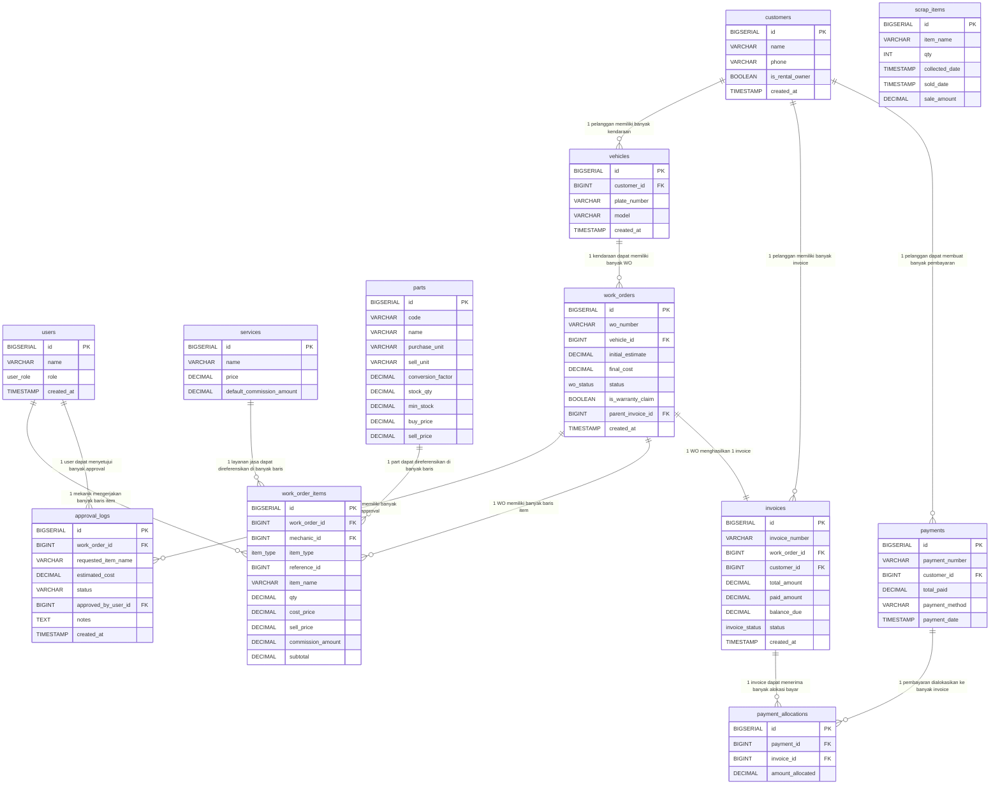

# ERD & Daftar Tabel — Sistem Bengkel Motor "Jaya Motor"

---

## 1. ERD Lengkap dengan Kardinalitas

---

## 2. Daftar Tabel Lengkap

### 🟦 Tabel Master (Data Referensi)

---

#### 📋 `users` — Master Pengguna & Mekanik

| Kolom | Tipe Data | PK | FK | Keterangan |
|---|---|:---:|:---:|---|
| `id` | `BIGSERIAL` | ✅ | | Auto-increment ID |
| `name` | `VARCHAR(250)` | | | Nama lengkap pengguna |
| `role` | `ENUM(owner, cashier, mechanic)` | | | Peran dalam sistem (RBAC) |
| `created_at` | `TIMESTAMP` | | | Waktu dibuat |

---

#### 📋 `customers` — Master Pelanggan

| Kolom | Tipe Data | PK | FK | Keterangan |
|---|---|:---:|:---:|---|
| `id` | `BIGSERIAL` | ✅ | | Auto-increment ID |
| `name` | `VARCHAR(250)` | | | Nama pelanggan |
| `phone` | `VARCHAR(50)` | | | Nomor HP (untuk approval call) |
| `is_rental_owner` | `BOOLEAN` | | | Flag: pelanggan pemilik rental (>20 unit) |
| `created_at` | `TIMESTAMP` | | | Waktu didaftarkan |

---

#### 📋 `vehicles` — Master Kendaraan

| Kolom | Tipe Data | PK | FK | Keterangan |
|---|---|:---:|:---:|---|
| `id` | `BIGSERIAL` | ✅ | | Auto-increment ID |
| `customer_id` | `BIGINT` | | ✅ → `customers.id` | Pemilik kendaraan |
| `plate_number` | `VARCHAR(20)` | | | Nomor plat (UNIQUE) — kunci pencarian garansi |
| `model` | `VARCHAR(100)` | | | Merek/model motor |
| `created_at` | `TIMESTAMP` | | | Waktu didaftarkan |

---

#### 📋 `services` — Master Layanan Jasa

| Kolom | Tipe Data | PK | FK | Keterangan |
|---|---|:---:|:---:|---|
| `id` | `BIGSERIAL` | ✅ | | Auto-increment ID |
| `name` | `VARCHAR(250)` | | | Nama jasa (misal: Servis Kelistrikan) |
| `price` | `DECIMAL(12,2)` | | | Harga jual jasa |
| `default_commission_amount` | `DECIMAL(12,2)` | | | Komisi default per item jasa |

---

#### 📋 `parts` — Master Suku Cadang & Persediaan

| Kolom | Tipe Data | PK | FK | Keterangan |
|---|---|:---:|:---:|---|
| `id` | `BIGSERIAL` | ✅ | | Auto-increment ID |
| `code` | `VARCHAR(50)` | | | Kode unik part (UNIQUE) |
| `name` | `VARCHAR(250)` | | | Nama part |
| `purchase_unit` | `VARCHAR(20)` | | | Satuan beli grosir (misal: Drum) |
| `sell_unit` | `VARCHAR(20)` | | | Satuan jual eceran (misal: Liter) |
| `conversion_factor` | `DECIMAL(10,2)` | | | Faktor konversi (1 Drum = 30 Liter) |
| `stock_qty` | `DECIMAL(10,2)` | | | Stok saat ini dalam satuan terkecil |
| `min_stock` | `DECIMAL(10,2)` | | | Batas minimum stok (alert) |
| `buy_price` | `DECIMAL(12,2)` | | | Harga beli/modal per satuan terkecil |
| `sell_price` | `DECIMAL(12,2)` | | | Harga jual per satuan terkecil |

---

### 🟧 Tabel Transaksi & Relasi (Non-Master)

---

#### ⚙️ `work_orders` — Header Work Order Servis

> **Alasan:** Tabel ini adalah pusat siklus servis motor — menyimpan status pengerjaan secara real-time (dari `queue` hingga `completed`) serta dual-estimate (`initial_estimate` vs `final_cost`) agar kasir dan pelanggan sama-sama punya bukti transparan biaya sebelum dan sesudah pembongkaran.

| Kolom | Tipe Data | PK | FK | Keterangan |
|---|---|:---:|:---:|---|
| `id` | `BIGSERIAL` | ✅ | | Auto-increment ID |
| `wo_number` | `VARCHAR(50)` | | | Nomor WO unik (WO-YYYYMMDD-XXX) |
| `vehicle_id` | `BIGINT` | | ✅ → `vehicles.id` | Motor yang diservis |
| `initial_estimate` | `DECIMAL(12,2)` | | | Estimasi biaya awal (sebelum bongkar) |
| `final_cost` | `DECIMAL(12,2)` | | | Biaya akhir aktual (setelah bongkar) |
| `status` | `ENUM(queue, diagnosing, waiting_approval, working, completed, cancelled)` | | | Status pengerjaan saat ini |
| `is_warranty_claim` | `BOOLEAN` | | | TRUE jika WO ini adalah klaim garansi |
| `parent_invoice_id` | `BIGINT` | | ✅ → `invoices.id` | Referensi invoice lama jika klaim garansi |
| `created_at` | `TIMESTAMP` | | | Waktu WO dibuat |

---

#### ⚙️ `approval_logs` — Log Persetujuan Pekerjaan Tambahan

> **Alasan:** Tabel ini mencatat jejak audit permintaan persetujuan pekerjaan tambahan secara digital — menggantikan komunikasi telepon manual yang tidak meninggalkan bukti — sehingga setiap keputusan `APPROVED`, `REJECTED`, atau `TIMEOUT_HOLD` tersimpan permanen beserta estimasi biayanya.

| Kolom | Tipe Data | PK | FK | Keterangan |
|---|---|:---:|:---:|---|
| `id` | `BIGSERIAL` | ✅ | | Auto-increment ID |
| `work_order_id` | `BIGINT` | | ✅ → `work_orders.id` | WO yang membutuhkan persetujuan |
| `requested_item_name` | `VARCHAR(250)` | | | Nama pekerjaan/item tambahan yang diajukan |
| `estimated_cost` | `DECIMAL(12,2)` | | | Estimasi biaya tambahan yang diajukan |
| `status` | `VARCHAR(20)` | | | Status: `PENDING`, `APPROVED`, `REJECTED`, `TIMEOUT_HOLD` |
| `approved_by_user_id` | `BIGINT` | | ✅ → `users.id` | User (kasir/pemilik) yang memberikan keputusan |
| `notes` | `TEXT` | | | Catatan tambahan dari approver |
| `created_at` | `TIMESTAMP` | | | Waktu permintaan dibuat |

---

#### ⚙️ `work_order_items` — Baris Detail Item Nota (Multi-Mekanik & Multi-Tipe)

> **Alasan:** Tabel ini adalah inti diferensiasi sistem — dengan kolom `item_type` sebagai diskriminator, setiap baris nota diperlakukan berbeda secara otomatis (jasa → hitung komisi, inventory → potong stok, direct_purchase → catat modal, trade_in → diskon + scrap +1) sehingga tidak ada lagi nota campur aduk tanpa komputasi yang benar.

| Kolom | Tipe Data | PK | FK | Keterangan |
|---|---|:---:|:---:|---|
| `id` | `BIGSERIAL` | ✅ | | Auto-increment ID |
| `work_order_id` | `BIGINT` | | ✅ → `work_orders.id` | WO induk |
| `mechanic_id` | `BIGINT` | | ✅ → `users.id` | Mekanik yang mengerjakan item ini (multi-mekanik) |
| `item_type` | `ENUM(service, inventory, direct_purchase, trade_in)` | | | Diskriminator tipe baris nota |
| `reference_id` | `BIGINT` | | (opsional) → `services.id` / `parts.id` | Referensi ke master jasa atau part |
| `item_name` | `VARCHAR(250)` | | | Nama item (fallback jika direct purchase) |
| `qty` | `DECIMAL(10,2)` | | | Kuantitas (mendukung desimal: 0.8 Liter) |
| `cost_price` | `DECIMAL(12,2)` | | | Harga modal (penting untuk direct_purchase & HPP) |
| `sell_price` | `DECIMAL(12,2)` | | | Harga jual ke pelanggan |
| `commission_amount` | `DECIMAL(12,2)` | | | Nominal komisi mekanik untuk baris ini |
| `subtotal` | `DECIMAL(12,2)` | | | Total baris: qty × sell_price |

---

#### ⚙️ `invoices` — Invoice / Tagihan Pelanggan

> **Alasan:** Tabel ini memisahkan dokumen tagihan (`invoices`) dari proses pengerjaan (`work_orders`) agar sistem bisa melacak status pembayaran secara independen — termasuk mendukung kondisi `partially_paid` (bon) dan `paid`, serta menampilkan `balance_due` secara real-time tanpa harus menghitung ulang dari tabel `payments`.

| Kolom | Tipe Data | PK | FK | Keterangan |
|---|---|:---:|:---:|---|
| `id` | `BIGSERIAL` | ✅ | | Auto-increment ID |
| `invoice_number` | `VARCHAR(50)` | | | Nomor invoice unik (INV-YYYYMMDD-XXX) |
| `work_order_id` | `BIGINT` | | ✅ → `work_orders.id` | WO yang menghasilkan invoice ini |
| `customer_id` | `BIGINT` | | ✅ → `customers.id` | Pelanggan yang ditagih |
| `total_amount` | `DECIMAL(12,2)` | | | Total tagihan keseluruhan |
| `paid_amount` | `DECIMAL(12,2)` | | | Jumlah yang sudah dibayar |
| `balance_due` | `DECIMAL(12,2)` | | | Sisa tagihan (total - paid) |
| `status` | `ENUM(unpaid, partially_paid, paid)` | | | Status pembayaran invoice |
| `created_at` | `TIMESTAMP` | | | Waktu invoice diterbitkan |

---

#### ⚙️ `payments` — Header Pembayaran (Termasuk Bulk Payment)

> **Alasan:** Tabel ini merekam satu transaksi pembayaran tunggal — termasuk pembayaran sekaligus (bulk) oleh pemilik rental — sebagai header yang kemudian dipecah detailnya ke `payment_allocations`, sehingga jejak "siapa bayar berapa dan kapan" selalu terekam secara utuh.

| Kolom | Tipe Data | PK | FK | Keterangan |
|---|---|:---:|:---:|---|
| `id` | `BIGSERIAL` | ✅ | | Auto-increment ID |
| `payment_number` | `VARCHAR(50)` | | | Nomor pembayaran unik |
| `customer_id` | `BIGINT` | | ✅ → `customers.id` | Pelanggan yang membayar |
| `total_paid` | `DECIMAL(12,2)` | | | Total uang yang diterima dalam 1 transaksi |
| `payment_method` | `VARCHAR(50)` | | | Metode: `cash` / `transfer` |
| `payment_date` | `TIMESTAMP` | | | Waktu pembayaran dilakukan |

---

#### ⚙️ `payment_allocations` — Pivot Alokasi Pembayaran ke Invoice (Bulk & Parsial)

> **Alasan:** Tabel pivot Many-to-Many ini adalah mekanisme *matriks alokasi* yang memungkinkan 1 pembayaran terdistribusi ke banyak invoice sekaligus (bulk payment rental) dan sebaliknya 1 invoice bisa menerima cicilan dari banyak pembayaran (partial payment), sehingga kasir tidak perlu lagi coret-coret buku piutang secara manual.

| Kolom | Tipe Data | PK | FK | Keterangan |
|---|---|:---:|:---:|---|
| `id` | `BIGSERIAL` | ✅ | | Auto-increment ID |
| `payment_id` | `BIGINT` | | ✅ → `payments.id` | Pembayaran induk |
| `invoice_id` | `BIGINT` | | ✅ → `invoices.id` | Invoice yang dipotong pembayaran ini |
| `amount_allocated` | `DECIMAL(12,2)` | | | Nominal potongan untuk invoice ini |

---

#### ⚙️ `scrap_items` — Inventaris Barang Bekas / Aki Bekas

> **Alasan:** Tabel ini menampung pencatatan otomatis setiap aki bekas yang masuk melalui mekanisme `trade_in` di `work_order_items` — menggantikan penumpukan fisik tak tercatat di pojok bengkel — sehingga Pak Hendra bisa melihat rekap kuantitas aki bekas kapan saja dan mencatat transaksi penjualan ke pengepul secara digital.

| Kolom | Tipe Data | PK | FK | Keterangan |
|---|---|:---:|:---:|---|
| `id` | `BIGSERIAL` | ✅ | | Auto-increment ID |
| `item_name` | `VARCHAR(100)` | | | Nama barang bekas (default: `Aki Bekas`) |
| `qty` | `INT` | | | Jumlah unit yang terkumpul |
| `collected_date` | `TIMESTAMP` | | | Waktu aki bekas masuk ke scrap inventory |
| `sold_date` | `TIMESTAMP` | | | Waktu terjual ke pengepul (nullable) |
| `sale_amount` | `DECIMAL(12,2)` | | | Harga jual total ke pengepul |

---

## 3. Ringkasan Kardinalitas

| Relasi | Tabel A | Tabel B | Kardinalitas | Keterangan |
|---|---|---|:---:|---|
| Pelanggan → Kendaraan | `customers` | `vehicles` | **1 : N** | 1 pelanggan bisa punya banyak motor (terutama rental >20 unit) |
| Kendaraan → Work Order | `vehicles` | `work_orders` | **1 : N** | 1 motor bisa masuk bengkel berkali-kali |
| Work Order → Approval Log | `work_orders` | `approval_logs` | **1 : N** | 1 WO bisa punya banyak permintaan persetujuan (bertahap) |
| Work Order → Item | `work_orders` | `work_order_items` | **1 : N** | 1 WO berisi banyak baris pekerjaan & sparepart |
| Work Order → Invoice | `work_orders` | `invoices` | **1 : 1** | 1 WO menghasilkan tepat 1 invoice |
| Pelanggan → Invoice | `customers` | `invoices` | **1 : N** | 1 pelanggan punya banyak riwayat tagihan |
| Pelanggan → Pembayaran | `customers` | `payments` | **1 : N** | 1 pelanggan bisa melakukan banyak transaksi bayar |
| Pembayaran ↔ Invoice | `payments` | `invoices` | **M : N** | Via `payment_allocations` — 1 bayar ke banyak nota & sebaliknya |
| Mekanik → Item | `users` | `work_order_items` | **1 : N** | 1 mekanik mengerjakan banyak baris item (multi-mekanik per WO) |
| Jasa → Item | `services` | `work_order_items` | **1 : N** | 1 jasa bisa digunakan di banyak WO berbeda |
| Part → Item | `parts` | `work_order_items` | **1 : N** | 1 part bisa digunakan di banyak WO berbeda |

---

*Dokumen ERD & Daftar Tabel — Sistem Operasional Bengkel Jaya Motor*
